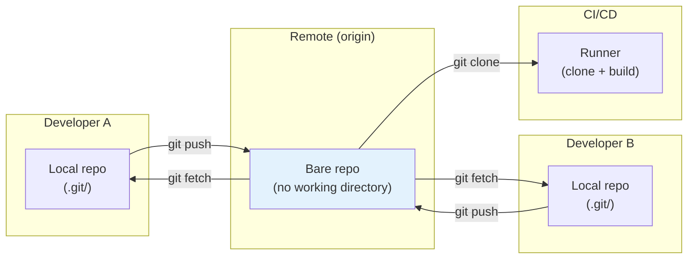
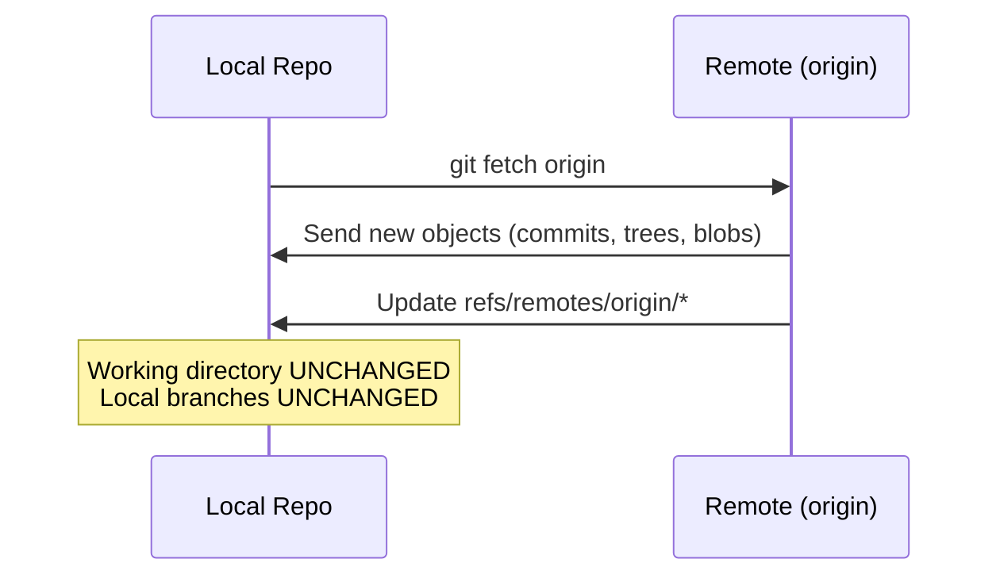
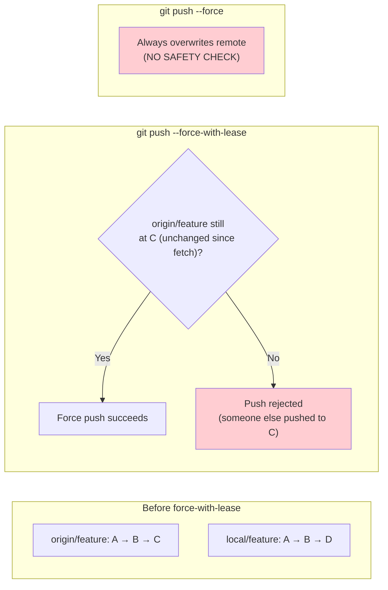
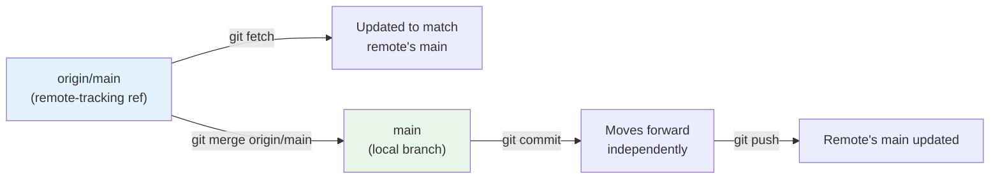

## Distributed Architecture

Git's distributed architecture means there is no intrinsic client-server relationship. Any repository can act as a "remote" for any other. In practice, one repository is designated as the "canonical" or "origin" repository, and all others sync with it.



### Bare vs Non-Bare Repositories

| Type                   | Working Directory | Purpose                                       |
| ---------------------- | ----------------- | --------------------------------------------- |
| **Non-bare** (default) | Yes               | Developer workstation — edit, commit, push    |
| **Bare** (`--bare`)    | No                | Server-side repository — receives pushes only |

A bare repository is just the `.git/` directory without a working tree. It is the standard format for remote servers (GitHub, GitLab, Gitea):

```bash
# Create a bare repository
$ git init --bare project.git

# Clone from a bare repository
$ git clone user@server:/path/to/project.git
```

:::info

Never push to a non-bare repository that has a checked-out working tree. The push will update the remote's branch pointer, but the remote's working directory and index will not be updated, causing inconsistencies. If you need a server-side repo with a working tree, use a **post-receive hook** to check out the files.

:::

## Configuring Remotes

### Adding Remotes

```bash
# Add a remote named "origin" (conventional name for the primary remote)
$ git remote add origin https://github.com/user/repo.git

# Add a secondary remote
$ git remote add upstream https://github.com/org/repo.git

# Add with a custom fetch refspec
$ git remote add origin https://github.com/user/repo.git
```

### Managing Remotes

```bash
# List all remotes
$ git remote -v
origin  https://github.com/user/repo.git (fetch)
origin  https://github.com/user/repo.git (push)
upstream  https://github.com/org/repo.git (fetch)
upstream  https://github.com/org/repo.git (push)

# Show details for a specific remote
$ git remote show origin

# Rename a remote
$ git remote rename old-name new-name

# Remove a remote
$ git remote remove upstream

# Change a remote's URL
$ git remote set-url origin git@github.com:user/repo.git
```

### URLs: HTTPS vs SSH

| Protocol  | URL Format                         | Authentication   | Use Case                                     |
| --------- | ---------------------------------- | ---------------- | -------------------------------------------- |
| **HTTPS** | `https://github.com/user/repo.git` | Token / password | Public repos, CI/CD, firewalled environments |
| **SSH**   | `git@github.com:user/repo.git`     | SSH key          | Frequent pushes, personal development        |

:::tip

Use SSH for personal development (no password prompts after key setup). Use HTTPS for CI/CD (easier to inject tokens as environment variables). GitHub recommends HTTPS for all new repositories.

:::

## Fetch

`git fetch` downloads objects and references from a remote repository **without modifying your working directory or branches**. It updates your remote-tracking branches (e.g., `origin/main`) but does not merge anything.

```bash
# Fetch all remotes and all branches
$ git fetch --all

# Fetch from a specific remote
$ git fetch origin

# Fetch a specific branch
$ git fetch origin main

# Fetch and prune deleted remote branches
$ git fetch --prune
# Equivalent to: git fetch --all && git remote prune origin
```

### What Fetch Does



After fetching, you can inspect the differences:

```bash
# See what commits are on origin/main that you don't have
$ git log HEAD..origin/main

# See what commits you have that origin/main doesn't
$ git log origin/main..HEAD

# See all differences (both directions)
$ git log HEAD...origin/main
```

## Pull

`git pull` is a shorthand for `git fetch` followed by `git merge` (or `git rebase`):

```bash
# Default: fetch + merge
$ git pull origin main

# Fetch + rebase (recommended for clean history)
$ git pull --rebase origin main

# Configure rebase as default pull behavior
$ git config --global pull.rebase true
```

### Why `--rebase` is Usually Better

Without `--rebase`, `git pull` creates a merge commit for every pull, cluttering the history:

```mermaid
gitGraph
    commit id: "A"
    checkout origin/main
    commit id: "B"
    checkout main
    commit id: "C (your local work)"
    merge origin/main id: "D (merge commit from pull)"
    commit id: "E (more local work)"
    merge origin/main id: "F (another merge commit from pull)"
```

With `--rebase`, your local commits are replayed on top of the remote, maintaining a linear history:

```mermaid
gitGraph
    commit id: "A"
    checkout origin/main
    commit id: "B"
    checkout main
    commit id: "C'"
    commit id: "E'"
```

:::warning

`git pull --rebase` rewrites your local commit hashes. This is safe as long as you have not pushed those commits to a shared branch. If you have, see the [Golden Rule of Rebasing](../03-branching-and-merging/03-rebasing.md#the-golden-rule-of-rebasing).

:::

## Push

`git push` uploads local commits to a remote repository and updates the remote's branch pointer.

```bash
# Push current branch to its tracking remote
$ git push

# Push a specific branch to a specific remote
$ git push origin feature-auth

# Push and set up tracking
$ git push -u origin feature-auth

# Push all branches
$ git push --all origin

# Push all tags
$ git push --tags
```

### Push Safety

By default, Git refuses to push a non-fast-forward update:

```
error: failed to push some refs to 'origin'
hint: Updates were rejected because the tip of your current branch is behind
hint: its remote counterpart. Integrate the remote changes (e.g.
hint: 'git pull ...') before pushing again.
```

This prevents overwriting commits that other developers may have based their work on.

### Force Push

Force pushing overwrites the remote branch with your local branch, discarding any commits on the remote that are not in your local history:

```bash
# Force push (DANGEROUS)
$ git push --force origin feature-auth

# Safer force push: only if the remote is a fast-forward of your branch
$ git push --force-with-lease origin feature-auth
```



:::warning

- **`--force`**: Unconditionally overwrites the remote. Use only on branches you exclusively own.
- **`--force-with-lease`**: Only overwrites if the remote has not changed since your last fetch. **Always prefer this over `--force`.**

Never force push `main` or any shared branch. The consequences are:

1. Other developers' histories diverge from the remote.
2. Their next `git push` will be rejected.
3. They must `git pull --rebase` or reset their branches, potentially losing their own unpushed commits.

:::

## Clone

`git clone` creates a local copy of a remote repository:

```bash
# Standard clone
$ git clone https://github.com/user/repo.git

# Clone into a specific directory
$ git clone https://github.com/user/repo.git my-project

# Shallow clone (only the latest commit, no history)
$ git clone --depth=1 https://github.com/user/repo.git

# Clone a specific branch
$ git clone --branch feature-auth https://github.com/user/repo.git

# Sparse clone (only specific directories)
$ git clone --filter=blob:none --sparse https://github.com/user/repo.git
$ cd repo
$ git sparse-checkout set src/docs
```

### What Clone Creates

```bash
$ git clone https://github.com/user/repo.git
```

This is equivalent to:

```bash
$ mkdir repo && cd repo
$ git init
$ git remote add origin https://github.com/user/repo.git
$ git fetch origin
$ git checkout -b main origin/main  # or whatever the default branch is
```

The clone creates:

| Component              | Description                                     |
| ---------------------- | ----------------------------------------------- |
| `.git/`                | Full local repository with all objects and refs |
| Working directory      | Checkout of the default branch                  |
| `origin` remote        | Points to the source URL                        |
| `main` tracking branch | Tracks `origin/main`                            |

### Clone Variants

| Variant     | Command               | Use Case                                       |
| ----------- | --------------------- | ---------------------------------------------- |
| **Full**    | `git clone`           | Development — full history, all branches       |
| **Shallow** | `git clone --depth=1` | CI/CD — only latest commit, minimal disk usage |
| **Sparse**  | `git clone --sparse`  | Monorepos — only specific directories          |
| **Mirror**  | `git clone --mirror`  | Backup/migration — all refs, bare repository   |
| **Bare**    | `git clone --bare`    | Server setup — no working directory            |

## Remote-Tracking Branches

Remote-tracking branches (e.g., `origin/main`) are local references that represent the state of a remote branch as of the last `git fetch`. They are updated automatically by `fetch` and `pull`, but **never by local commits**.



```bash
# Difference between local and remote
$ git log HEAD..origin/main    # Commits on remote that you don't have
$ git log origin/main..HEAD    # Commits you have that remote doesn't

# Fetch without merging
$ git fetch origin

# Merge remote changes
$ git merge origin/main

# Or: fetch + rebase in one step
$ git pull --rebase origin main
```

## Practical Workflows

### Fork-Based Workflow (Open Source)

```bash
# 1. Fork the repository on GitHub
# 2. Clone your fork
$ git clone https://github.com/you/repo.git
$ cd repo

# 3. Add the upstream repository
$ git remote add upstream https://github.com/org/repo.git

# 4. Create a feature branch
$ git switch -c feature-auth main

# 5. Keep up-to-date with upstream
$ git fetch upstream
$ git rebase upstream/main

# 6. Push to your fork
$ git push origin feature-auth

# 7. Create a pull request from your fork to the upstream repo
```

### Shared Repository Workflow (Team)

```bash
# 1. Clone the shared repository
$ git clone git@github.com:org/repo.git
$ cd repo

# 2. Create a feature branch
$ git switch -c feature-auth

# 3. Commit and push frequently
$ git commit -m "WIP: auth module"
$ git push -u origin feature-auth

# 4. Create a pull request
# 5. After review and approval, merge via the PR interface
```
