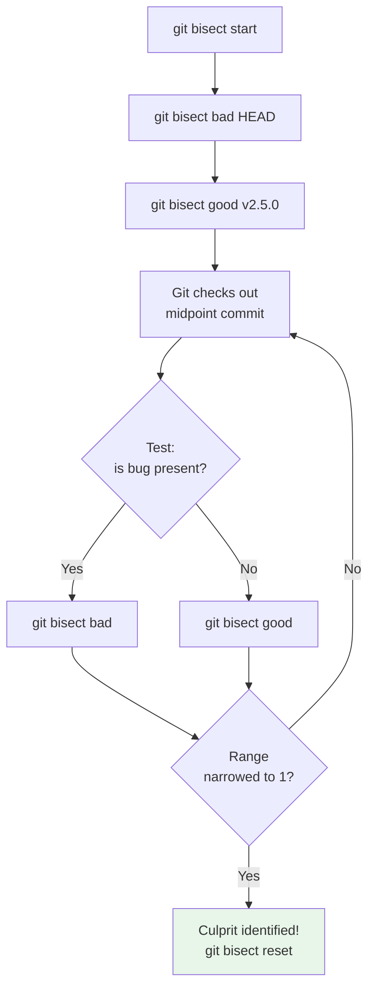

## Binary Search for Bugs

`git bisect` uses **binary search** to find the specific commit that introduced a bug. Given a known-good commit and a known-bad commit, it checks out commits between them, narrowing the range by half each iteration until it identifies the exact culprit.

### Why Manual Debugging Fails

When a bug is discovered in production, you may need to search through hundreds or thousands of commits to find when it was introduced. Linear search (checking each commit one by one) has $O(n)$ time complexity. Binary search reduces this to $O(\log_2 n)$:

| Commits to search | Linear steps | Binary steps |
| ----------------- | ------------ | ------------ |
| 100               | 100          | 7            |
| 1,000             | 1,000        | 10           |
| 10,000            | 10,000       | 14           |
| 100,000           | 100,000      | 17           |

## Basic Usage

```bash
# Start a bisect session
$ git bisect start

# Mark the current commit as bad (bug is present)
$ git bisect bad

# Mark a known-good commit
$ git bisect good v2.5.0

# Git checks out a commit halfway between v2.5.0 and HEAD
# Build and test the code...
# If the bug is present:
$ git bisect bad
# If the bug is NOT present:
$ git bisect good

# Repeat until git identifies the culprit:
# a3f2b1c0 is the first bad commit
# commit a3f2b1c0
# Author: Developer <dev@example.com>
# Date:   Mon Jun 2 10:00:00 2025
#
#     Refactor authentication module
```



### One-Line Syntax

```bash
# Equivalent to the above, in a single command
$ git bisect start HEAD v2.5.0
```

## Automated Bisect

For bugs that can be detected by a script (exit code 0 = good, non-zero = bad), you can automate the entire process:

```bash
# Define a test script
$ cat > test_bug.sh << 'EOF'
#!/bin/bash
make build
./run_tests --suite auth
EOF
$ chmod +x test_bug.sh

# Run automated bisect
$ git bisect start HEAD v2.5.0
$ git bisect run ./test_bug.sh

# Git automatically tests each midpoint and identifies the culprit
# a3f2b1c0 is the first bad commit
```

The `run` command will:

1. Check out each midpoint commit.
2. Run the script.
3. Mark the commit as `bad` if the script exits non-zero, `good` if it exits zero.
4. Continue until the range is narrowed to one commit.

:::tip

Write your bisect script to be **idempotent** — it should produce the same result regardless of the system state. Clean build artifacts, use a fresh database, etc. Otherwise, you may get false positives from stale state.

:::

## Bisect with Skipped Commits

Some commits may not build (e.g., due to a missing dependency or a known compilation error). You can skip them:

```bash
$ git bisect skip
# Git adjusts the search range to avoid this commit
```

If many commits cannot be tested, bisect may not find a single culprit. It will report the range:

```
There are only 'skip'ped commits left to test.
The first bad commit could be any of:
a3f2b1c0...c1d2e3f4
b7e9d4f5...d4e5f6a7
```

## Terminating a Bisect Session

```bash
# Reset to the original branch after finding the culprit
$ git bisect reset

# Reset to a specific branch
$ git bisect reset main
```

`git bisect reset` restores the branch you were on before starting the bisect.

## Bisect Best Practices

### 1. Use Good/Bad Markers Strategically

- **Bad**: The commit where the bug is confirmed present (usually `HEAD` or a specific release tag).
- **Good**: The most recent commit where the bug is confirmed absent. The closer this is to the bad commit, the fewer iterations needed.

### 2. Write Reproducible Test Scripts

```bash
#!/bin/bash
set -e

# Build from scratch (no cached artifacts)
make clean
make -j$(nproc)

# Run the specific test that catches the bug
./run_tests --suite auth --fail-fast
```

### 3. Bisect in CI/CD

Integrate bisect into your CI pipeline to automatically identify regressions:

```bash
# In your CI job, after a test failure:
$ git bisect start HEAD $PREVIOUS_GREEN_COMMIT
$ git bisect run make test
$ git bisect reset
```

### 4. Combine with `git blame`

Once you identify the culprit commit, use `git blame` to see which lines were changed:

```bash
# Show which commit changed each line in a file
$ git blame src/auth.c

# Show which commit changed a specific line
$ git blame -L 42,42 src/auth.c
```

Then examine the full commit:

```bash
$ git show a3f2b1c0
```
