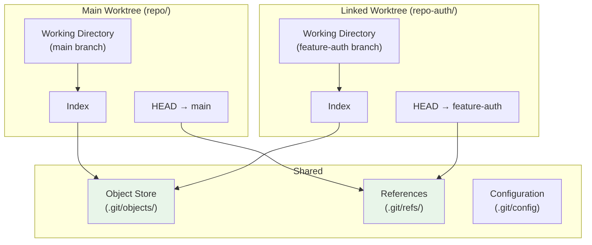

## What are Worktrees

`git worktree` allows you to have **multiple working directories** from the same repository, each checked out to a different branch. Unlike `git stash` (which temporarily shelves changes) or switching branches (which requires a clean working directory), worktrees let you work on multiple branches simultaneously.

### The Problem Worktrees Solve

Without worktrees, switching branches requires a clean working directory:

```bash
$ git switch feature-auth
# "error: Your local changes would be overwritten"
$ git stash
$ git switch feature-auth
# ... work on feature ...
$ git switch main
$ git stash pop
# ... work on main ...
```

With worktrees, both branches are available simultaneously:

```bash
$ git worktree add ../repo-auth feature-auth
$ cd ../repo-auth
# ... work on feature-auth ...
$ cd ../repo-main
# ... work on main simultaneously ...
```

## How Worktrees Work Internally

A worktree is a linked working directory that shares the same `.git` object database and refs as the main repository:

```
repo/                          # Main worktree
├── .git/                      # Full .git directory (object store, refs, etc.)
├── src/
│   └── main.c
└── README.md

repo-auth/                     # Linked worktree
├── .git                       # FILE (not directory!) containing path to main repo
├── src/
│   └── auth.c
└── README.md
```

The `.git` file in the linked worktree contains:

```
gitdir: /path/to/repo/.git/worktrees/repo-auth
```

And the main repository records the worktree:

```
repo/.git/
├── worktrees/
│   └── repo-auth/
│       ├── HEAD
│       ├── index
│       ├── commondir
│       └── gitdir
└── ...
```

Each worktree has its own:

- **HEAD** (pointing to its branch)
- **Index** (staging area)
- **Working directory**

But they share:

- **Object store** (`.git/objects/`)
- **References** (branches, tags)
- **Configuration**



## Creating Worktrees

### Basic Usage

```bash
# Create a worktree for an existing branch
$ git worktree add ../repo-auth feature-auth

# Create a worktree and a new branch simultaneously
$ git worktree add -b feature-auth ../repo-auth main

# Create a worktree at a specific commit (detached HEAD)
$ git worktree add ../repo-debug a3f2b1c

# Create a worktree for a new branch from a specific commit
$ git worktree add -b hotfix-crash ../repo-hotfix a3f2b1c
```

### Listing Worktrees

```bash
$ git worktree list
/path/to/repo          abc1234 [main]
/path/to/repo-auth     def5678 [feature-auth]
```

### Removing Worktrees

```bash
# Remove a worktree (deletes the working directory)
$ git worktree remove ../repo-auth

# Force remove (even if there are uncommitted changes)
$ git worktree remove --force ../repo-auth

# Prune stale worktree entries (if the directory was deleted manually)
$ git worktree prune
```

## Use Cases

### 1. Parallel Development

Work on a hotfix while in the middle of a feature:

```bash
$ git worktree add ../repo-hotfix -b hotfix-crash main
$ cd ../repo-hotfix
# Fix the crash, test, commit, push
$ cd ../repo-main
# Continue working on your feature — no stash needed
```

### 2. Side-by-Side Code Review

```bash
$ git worktree add ../repo-review origin/feature-auth
# Open both repos in your IDE
# Diff side-by-side between ../repo-main and ../repo-review
```

### 3. Long-Running Tests

```bash
$ git worktree add ../repo-test main
$ cd ../repo-test
# Run a 30-minute test suite on main
# Meanwhile, continue developing in ../repo-main
```

### 4. Build and Test Different Versions

```bash
$ git worktree add ../repo-v1 v1.0
$ git worktree add ../repo-v2 v2.0
# Build and test both versions simultaneously
```

## Limitations

### No Duplicate Branches

Each branch can only be checked out in **one** worktree at a time:

```bash
$ git worktree add ../repo-auth main
# Error: 'main' is already checked out at '/path/to/repo'
```

### Bare Repositories

A bare repository (no working directory) cannot have a main worktree. All worktrees are linked:

```bash
$ git init --bare project.git
$ git worktree add project-main main
```

### Submodule Interaction

Submodules in worktrees can be tricky — each worktree initializes submodules independently, which can lead to conflicts:

```bash
# In each worktree, initialize submodules separately
$ cd ../repo-auth
$ git submodule update --init --recursive
```

## Worktree vs Stash vs Branch

| Feature           | Worktree               | Stash                | Branch            |
| ----------------- | ---------------------- | -------------------- | ----------------- |
| Parallel work     | Yes                    | No                   | No (must switch)  |
| Persistent        | Yes (until removed)    | Until popped/dropped | Yes               |
| Independent index | Yes                    | No (single index)    | No (single index) |
| Disk usage        | Higher (full checkout) | Minimal              | Minimal           |
| Setup cost        | `git worktree add`     | `git stash push`     | `git switch`      |

**Rule of thumb**: Use worktrees when you need to work on two things simultaneously for more than a few minutes. Use stash for brief interruptions. Use branches for sequential work.
