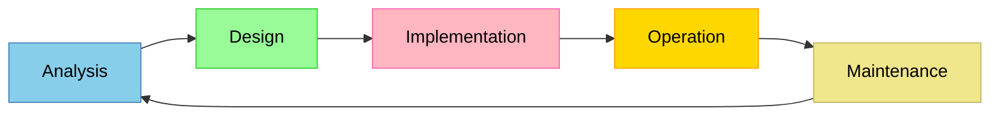

## Planning and System Installation
### Computer System
A computer system is a broad term given to a system including the hardware, software, users, and the immediate environment. 

### System Life Cycle
System life cycle is the stages carried out when developing a new system.

### Organizational Issue Planning Aims to Eliminate
Planning a system is an attempt to anticipate potential organizational issues:
- Problems arise in guiding organization and business strategies
- Insufficient stakeholder and end-user communication
- Problems with ownership of the system
- The lack of attention in required training

### Feasibility Report
Feasibility reports are the results of a feasibility study where the evaluation and analysis of a project and its potential is carried out based on:
- Technical feasibility
  - Determining whether current technology sufficient to implement the system
- Economic feasibility
  - Determining the cost effectiveness and whether funding is sufficient
- Legal feasibility
  - Analyzing potential conflicts between the proposed system and the legal system
- Operational feasibility
  - Determining whether the maintenance stage of the system is feasible
- Schedule feasibility
  - Estimating the time required to create the system

## Change Management
Change management is the process of changing the state of the organization, involving shifting employee positions, replacing hardware equipment, etc.

### Incompatibility
System may include critical points built with legacy systems, where the new system is unable to replace by change, examples being:
- Lack of ability to translate legacy format to new format.
- User needs, where a lack of user training or the new system does not completely replace the functionality of the old system.

## Business Merger
Business merger is the process of combining business entities, where all subsystems are required to be compatible.

### System Integration
System integration is the process of combining subsystems, where there are four strategies:
- Operate in redundancy
  - Develop both systems to have equivalent functionality
- Replace both systems with a new system
- Select the best subsystems from each company and combine them
- Select the system of one company and terminating the alternative system

### System Deployment Models
#### On-premises Software
On-premises software are software operate locally on an organization's own infrastructure.

#### SaaS
Software-as-a-Service (SaaS) are software provided by cloud service, where data and the software is operating in a remote datacenter.

### Installation Process
The installation process is the deployment of a new system on a premise. 

#### Changeover Method
When replacing the system currently used, strategies employed should consider the cost overhead and risk, common strategies include:
- Parallel changeover
  - Operating both systems in redundancy for the duration of replacement.
  - Advantages:
    - Functionality of both systems can be compared live
    - IF the new system fails, the system can be reverted to the legacy system
  - Disadvantages:
    - Large cost overhead 
    - Extra workload 
- Direct changeover
- Pilot testing
- Phased

### Data Migration
In order to satisfy the information system of the new system, legacy data formats need to be translated to the new data format, this is called data migration. In a data migration process, the following steps are carried out:
- Extract data from legacy system
- Transform data for new system
- Load data into the new system
- Validate the data loaded

## Testing 
- Functional testing
  - Testing conducted to validate the functionality of target commands.
- Data testing
  - Testing conducted to validate the output of target commands by sets of normal, abnormal and boundary data.
    - Normal data refers to a input sequence set within the expected domain
    - Abnormal data refers to a input sequence set outside of the expected domain
    - Boundary data refers to a input sequence set at the boundary of the normal data set
- Alpha testing
  - Testing carried out by the development team within the company and deployed on premises.
- Beta testing
  - Testing carried out by assigned end-users outside of the company and deployed on user premises.
- Dry-run testing
  - Testing carried out by examining the source code and determining the functionality by predicting the output.
- Unit testing
  - Testing on individual subsystems modularly.
- User acceptance testing
  - Testing for user satisfaction based on its usability and accessibility.
- Debugging
  - Testing during development to discover malfunctions.

### Data Validation
Validation is the process of evaluating whether input sequence fit within the expected domain.

### Data Verification
Verification is the process of evaluating the consistency of the input sequence and the source data.

## User Documentation
User documentations are manuals design to explain the functionality of the system to the end-user.

### Methods of Providing User Documentation
The term user documentation does not restrict the form of access, where online and written documents are allowed, some methods of providing the user documentation include:
- User Manuel
- Embedded Assistance Subsystem
- Real time assistance
- Email Support
- Web support
- FAQ
- Remote desktop connection

## User Training
In order to equip the workforce with a new system, user training is required to ensure the system is used for its full capacity, some methods include:
- Self-study
- Formal classes
- Remote training

## Data Loss
Data loss is the error condition for which the information stored is destroyed. The cause of data loss can include:
- Accidental deletion
- Administrative errors
- Poor storage system
- Hardware damage
- Computer virus
- Data corruption
- Natural disasters
- Power failure

### Data Loss Prevention
- Regular Backup (mirroring) with a remote datacenter or with SaaS
- Firewall installation
- Storing on printed copies
- Usage of antivirus software
- Failover system
  - A autonomous system on standby for switching to a parallel computer system upon a system failure

## Software Deployment
The versioning system of a system is usually divided by:
- Patches
  - Bug fixes
- Updates
  - Expansion by increasing functionalities
- Upgrades
  - Large changes that normally lead to breaking changes (incompatibility between the new version and previous version)
- Releases
  - Version released to end-users after testing stages.

